#Solution 1 


# Presidential voting in Georgia        

Read the csv for the voting across counties in Georgia: 


```r
georgiaData = read.csv('../data/georgia2000.csv')

#Calculate the undercounts and the fraction of undercounts

georgiaData$underCount<-georgiaData$ballots-georgiaData$votes
georgiaData$underCountPerCent<-round(100*(georgiaData$underCount/georgiaData$ballots),2)
```

### Basic Summary

* There are a total of 159  counties and each county has a different equipment for voting (4 different equiments - LEVER, OPTICAL, PUNCH, PAPER)

* Out of  2,691,314 ballots, 2,596,633 were counted leading to an undercount of 3.52% in Georgia 


* The county of FULTON has the highest undercounts with 17,764 which constitutes to 6.32 % of the total ballots casted in the county 


* The county of BEN.HILL has the highest proportion of  undercounts 
with 18.81% out of  5,741 ballots casted in the county


```r
summary(georgiaData)
```

```
##       county       ballots           votes            equip   
##  APPLING :  1   Min.   :   881   Min.   :   832   LEVER  :74  
##  ATKINSON:  1   1st Qu.:  3694   1st Qu.:  3506   OPTICAL:66  
##  BACON   :  1   Median :  6712   Median :  6299   PAPER  : 2  
##  BAKER   :  1   Mean   : 16927   Mean   : 16331   PUNCH  :17  
##  BALDWIN :  1   3rd Qu.: 12251   3rd Qu.: 11846               
##  BANKS   :  1   Max.   :280975   Max.   :263211               
##  (Other) :153                                                 
##       poor            urban           atlanta            perAA       
##  Min.   :0.0000   Min.   :0.0000   Min.   :0.00000   Min.   :0.0000  
##  1st Qu.:0.0000   1st Qu.:0.0000   1st Qu.:0.00000   1st Qu.:0.1115  
##  Median :0.0000   Median :0.0000   Median :0.00000   Median :0.2330  
##  Mean   :0.4528   Mean   :0.2642   Mean   :0.09434   Mean   :0.2430  
##  3rd Qu.:1.0000   3rd Qu.:1.0000   3rd Qu.:0.00000   3rd Qu.:0.3480  
##  Max.   :1.0000   Max.   :1.0000   Max.   :1.00000   Max.   :0.7650  
##                                                                      
##       gore             bush          underCount      underCountPerCent
##  Min.   :   249   Min.   :   271   Min.   :    0.0   Min.   : 0.000   
##  1st Qu.:  1386   1st Qu.:  1804   1st Qu.:  152.5   1st Qu.: 2.780   
##  Median :  2326   Median :  3597   Median :  296.0   Median : 3.980   
##  Mean   :  7020   Mean   :  8929   Mean   :  595.5   Mean   : 4.379   
##  3rd Qu.:  4430   3rd Qu.:  7468   3rd Qu.:  523.5   3rd Qu.: 5.650   
##  Max.   :154509   Max.   :140494   Max.   :17764.0   Max.   :18.810   
## 
```

```r
hist(georgiaData$underCountPerCent, main = "Distribution of undercount percentage ", ylab="Number of counties",xlab = "Undercount Percent",col = "blue")
```

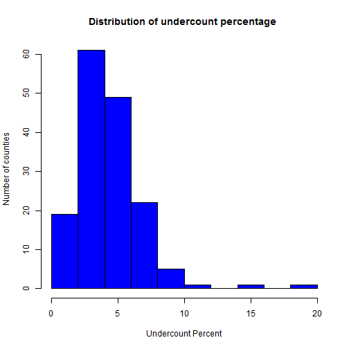 


### Deciphering the reasons of vote undercount

* We aggregate on the type of equipment to understand which equipment is responsible for most number of invalid votes

    + Optical has the highest and Paper based equipment has the least number of vote undercounts 
    + When we normalize using the number of ballots in each equipment, we realize that punch has the highest % of undercounts as compared to optical (which has the least)
    + This means optical has the highest undercount as a absolute number because it is the most used equipment too
    + We can infer (from the histogram) that people have issues with interpreting the PUNCH and LEVER ballot system as compared to others
  

```r
adf= aggregate(cbind(ballots,votes)~equip,data=georgiaData,sum)
adf$ucPercent<-100*(adf$ballots-adf$votes)/(adf$ballots)


barplot((adf$ballots-adf$votes),col="blue",main="Number of Undercounts across equipments",names.arg = adf$equip,xlab = "Equipment",ylab = "Number of vote undercount")
```

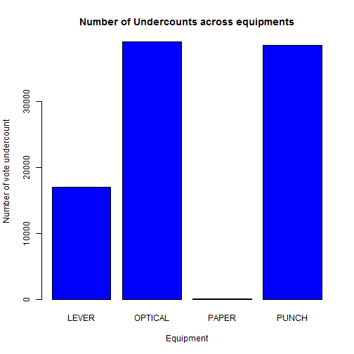 

```r
barplot(adf$ucPercent,col="blue",main="% Undercounts across equipments",names.arg = adf$equip,xlab = "Equipment",ylab = "Percentage vote undercount")
```

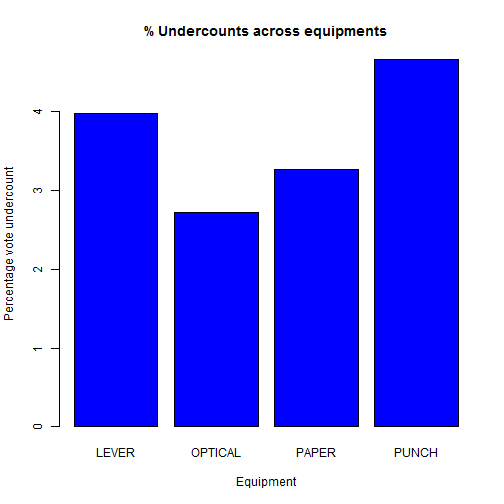 


### Impact on the poor and minority communities 


```r
poorGeorgia<-georgiaData[georgiaData$poor==1,]

poordf=aggregate(cbind(ballots,votes)~equip,data=poorGeorgia,sum)
poordf$ucPercent<-100*(poordf$ballots-poordf$votes)/(poordf$ballots)

poordf
```

```
##     equip ballots  votes ucPercent
## 1   LEVER  219254 209054  4.652139
## 2 OPTICAL  114465 107008  6.514655
## 3   PAPER    3454   3341  3.271569
## 4   PUNCH   23612  22183  6.052007
```

```r
richGeorgia<-georgiaData[georgiaData$poor==0,]

richdf=aggregate(cbind(ballots,votes)~equip,data=richGeorgia,sum)
richdf$ucPercent<-100*(richdf$ballots-richdf$votes)/(richdf$ballots)

richdf=rbind(richdf,c("PAPER",0,0,0))
richdf=rbind(richdf[1:2,],richdf[4,],richdf[3,])

richdf
```

```
##     equip ballots   votes        ucPercent
## 1   LEVER  208526  201710  3.2686571458715
## 2 OPTICAL 1321694 1290061 2.39336790512781
## 4   PAPER       0       0                0
## 3   PUNCH  800309  763276 4.62733769081692
```

### Observations 

* Counties with higher percentage of poor people have higher undercounts irresective of equipment they use 
* Optical seems to have the highst difference between the richer counties as compared to poor counties


```r
barplot(matrix(c(as.numeric(poordf$ucPercent),as.numeric(richdf$ucPercent)),nr=2,byrow = TRUE), beside=T, col=c("blue","grey"),names.arg=poordf$equip,xlab="Equipment",ylab="% Undercount",main="Poor vs Non Poor Undercount")

legend("topleft", c("Poor","Non Poor"), pch=15, 
       col=c("blue","grey"))
```

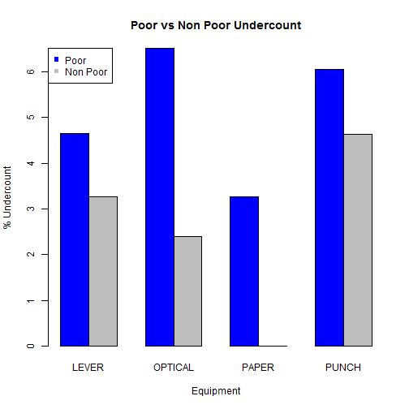 


```r
attach(georgiaData)

plot(x=perAA,y=underCountPerCent,main="Distribution of %vote undercount with percentage of African - American Population",col="red3",pch=19)
```

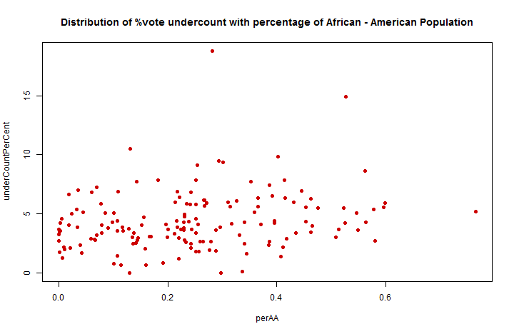 

```r
plot(x=perAA,y=underCountPerCent,main="Distribution of %vote undercount with percentage of African - American Population",pch=19,col=c("red","blue","green","yellow")[equip],xlab="African American Population",ylab="Vote undercount % ")

legend(x="topright", legend = levels(georgiaData$equip), col=c("red","blue","green","yellow"), pch=19)
```

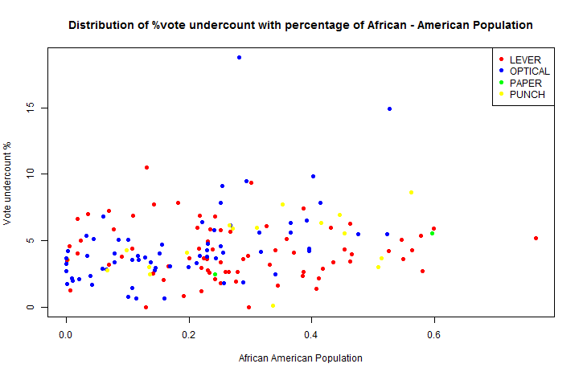 

```r
detach(georgiaData)
```

* There does not seem to have much of an impact of the percentage of African Americans on the %of vote undercount
* Majority of the counties with higher African American Population have Lever and Optical equioments for ballots 
* Many counties having higher african american population and comparitavely high vote undercount generally use optical or lever based equiments


#Solution2


### Downloading the data and return over each stock 

* Download data for stock price at a daily level using tickers 
* Create a helper function to calculate the return at a daily level


```r
library(mosaic)
library(fImport)
library(foreach)

# Import stocks based on tickers

mystocks = c("SPY","TLT","LQD","EEM","VNQ")
myprices = yahooSeries(mystocks, from='2010-07-30', to='2015-07-30')
```

```
## Warning in download.file(url = url, destfile = tmp): downloaded length
## 394462 != reported length 200
```

```
## Warning in download.file(url = url, destfile = tmp): downloaded length
## 224325 != reported length 200
```

```
## Warning in download.file(url = url, destfile = tmp): downloaded length
## 228316 != reported length 200
```

```
## Warning in download.file(url = url, destfile = tmp): downloaded length
## 210212 != reported length 200
```

```
## Warning in download.file(url = url, destfile = tmp): downloaded length
## 177039 != reported length 200
```

```r
# Function for calculating percent returns from a Yahoo Series

YahooPricesToReturns = function(series) 
  {
  	mycols = grep('Adj.Close', colnames(series))
  	closingprice = series[,mycols]
  	N = nrow(closingprice)
  	percentreturn = as.data.frame(closingprice[2:N,]) / as.data.frame(closingprice[1:(N-1),]) - 1
  	mynames = strsplit(colnames(percentreturn), '.', fixed=TRUE)
  	mynames = lapply(mynames, function(x) return(paste0(x[1], ".PctReturn")))
  	colnames(percentreturn) = mynames
  	as.matrix(na.omit(percentreturn))
}

# Compute the returns from the closing prices
myreturns = YahooPricesToReturns(myprices)
```

### Gauging the portfolio profitability

* Returns of each stock/ticker can be gauged by looking at the distribution of each of their return distribution
* Higher the mean of the return means it is more rofitable
* Lower the 5th quantile (left tail of distribution) higher the risk realted to the stock/portfolio
* Let us look at return distribution of each ticker and take a call on the risk/return profiles for each


```r
# Identity matrix (used for weights) for each iteration

wmatrix=diag(5)


for (j in 1:5)
{    
    n_days=20
    set.seed(11)
    
    # Now simulate many different possible trading years!
    sim1 = foreach(i=1:500, .combine='rbind') %do% {
    	totalwealth = 100000
      
    	#Simulate return of each stock
    	weights = wmatrix[j,]
    	
    	holdings = weights * totalwealth
    	wealthtracker = rep(0, n_days) # Set up a placeholder to track total wealth
    
    		for(today in 1:n_days) 
      {
    		return.today = resample(myreturns, 1, orig.ids=FALSE)
    		holdings = holdings + holdings*return.today
    		totalwealth = sum(holdings)
    		wealthtracker[today] = totalwealth
      	holdings = weights * totalwealth
    		
    	}
    	
    	wealthtracker
    }
    
    head(sim1)
    
    # Profit/loss
    if(j==1) hist(sim1[,n_days]- 100000,col=rgb(j,0,0,1/4),main="Histogram of 20 day return",xlim=c(-20000,20000),ylim=c(0,200)) 
    
    else hist(sim1[,n_days]- 100000,col=rgb(j/10,0,0,1/5),add=T,main="Histogram of 20 day return",xlim=c(-20000,20000),ylim=c(0,200))
    
    cat(mystocks[j],"\n")
    
    # Calculate 5% value at risk
    cat("5% : ",quantile(sim1[,n_days], 0.05) - 100000)
    
    # Mean
    cat("\nMean : ",mean(sim1[,n_days]- 100000))
    
    # SD
    cat("\nStandard Deviation : ",sd(sim1[,n_days]- 100000))
    
    # Calculate 5% value at risk
    cat("\n95 percentile : ",quantile(sim1[,n_days], 0.95) - 100000)
    
    cat("\n\n")
}   
```

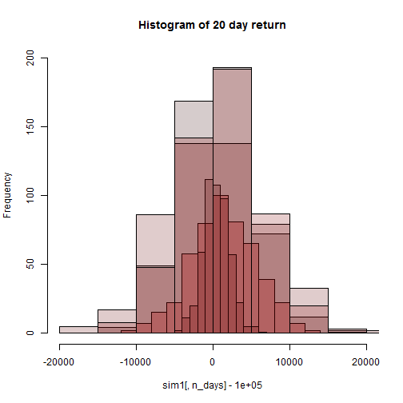 

```
## SPY 
## 5% :  -5817.023
## Mean :  1363.494
## Standard Deviation :  4258.296
## 95 percentile :  8229.731
## 
## TLT 
## 5% :  -6994.128
## Mean :  559.4138
## Standard Deviation :  4619.696
## 95 percentile :  7930.735
## 
## LQD 
## 5% :  -2308.954
## Mean :  475.8746
## Standard Deviation :  1712.379
## 95 percentile :  3145.45
## 
## EEM 
## 5% :  -9695.934
## Mean :  288.1675
## Standard Deviation :  6451.898
## 95 percentile :  10995.1
## 
## VNQ 
## 5% :  -6874.471
## Mean :  1249.792
## Standard Deviation :  5054.999
## 95 percentile :  9770.125
```


### Risk Return profiles of each of the stocks

* The risk / return of a stock can be gauged by the mean return within a period of time (20 days in this case)
* Bootstrapping can be used to understand the distribution of r eturn profile which can be understood by the standard deviation, the 5th and 95th percentile return 

  + LQD is the safest stock option. By safe, it means that there is minimal risk of losses (5 percentile loss of 2.3k on 100,000$ investment), though the scope for profit is less. The mean profit over a 20 day period is also low at 475.8$

  + SPY is the second most safe option among the five, with a return of 1363$ in a 20 day period on a 100,000$ investment and a loss profile of -5,817$ at the lowest 5% times 

* TLT is the third most safe stock among the five with a mean return of 559$ over a 20day period on investment of $100,000. The 5% return is a loss of close to 6994$ and a standard deviation of 4619$

* VNQ is the second most volatile stock among the options (5 presented in the portfolio). It has an average return of close to 1249$ on a investment of 100,000$ over a 20 day period

* EEM is the most volatile stock among the others in the portfolio with a 5% returns greater than 9695$ in losses. But having said that in its good days it can go upto $10,000 and higher (95% ercentile) in profits. The standard deviation of this stock is very varied, thus havig a high standard deviation  


```r
x=matrix(c(0.2, 0.2, 0.2, 0.2, 0.2,.1,.1,.8,0,0,0,0,0,.5,.5),nrow=3,byrow = T)
    
portfolio=c("Equal Split","Safe Portfolio","Aggresive Portfolio")

for (z in 1:3)
{
    n_days=20
 
  sim1 = foreach(i=1:500, .combine='rbind') %do% {
	totalwealth = 100000
	weights = x[z,]
	holdings = weights * totalwealth
	wealthtracker = rep(0, n_days) # Set up a placeholder to track total wealth

		for(today in 1:n_days) 
  {
		return.today = resample(myreturns, 1, orig.ids=FALSE)
		holdings = holdings + holdings*return.today
		totalwealth = sum(holdings)
		wealthtracker[today] = totalwealth
	}
	
	wealthtracker
  }
  

            # Profit/loss
        hist(sim1[,n_days]- 100000,col=rgb(1,0,0,1/4),main = portfolio[z],xlab=" $ Return") 
     
        cat(portfolio[z],"\n")
        
        # Calculate 5% value at risk
        cat("5% : ",quantile(sim1[,n_days], 0.05) - 100000)
        
        # Mean
        cat("\nMean : ",mean(sim1[,n_days]- 100000))
        
        # SD
        cat("\nStandard Deviation : ",sd(sim1[,n_days]- 100000))
        
        # Calculate 5% value at risk
        cat("\n95 percentile : ",quantile(sim1[,n_days], 0.95) - 100000)
        
        cat("\n\n")
}
```

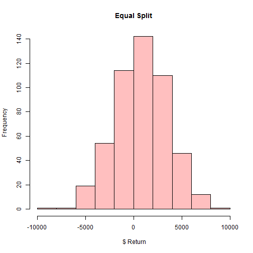 

```
## Equal Split 
## 5% :  -3566.541
## Mean :  833.4553
## Standard Deviation :  2698.109
## 95 percentile :  5142.327
```

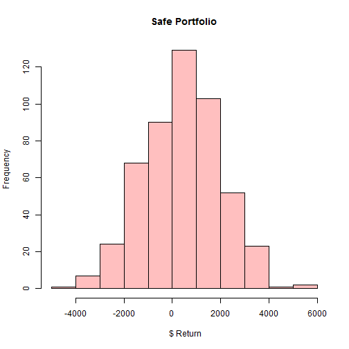 

```
## Safe Portfolio 
## 5% :  -2211.543
## Mean :  400.8965
## Standard Deviation :  1594.954
## 95 percentile :  3007.813
```

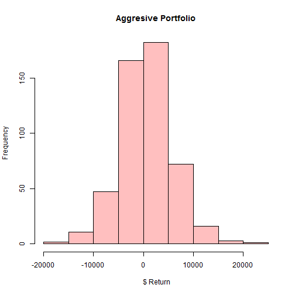 

```
## Aggresive Portfolio 
## 5% :  -8026.976
## Mean :  692.345
## Standard Deviation :  5291.017
## 95 percentile :  9059.818
```

### Portfolio 1 
### Even Split (20%) across all the stocks 

* For an equal split portfolio, the returns is a combinaton of the risk profiles of all the stocks
* The average return over 20 days on an investment of $100,000 is about $833
* 5% of the times a person holding this portfolio may incur losses of 3566$ 


### Portfolio 2 
### Safe portfolio  (atleast 3 stocks)

* For a safe portfolio, we choose the safest option as the highest amount in terms of investment. LQD (80%) and the other safe (comparitavely safe) stocks 10% each (SPY and TLT)

* It is safe in the sense that there is only 5% chances of losing more than $2211 

* But having said that there is not much scope of earning high returns. Only 5% earn more than 3007$ and on an average earn about 400$ over 20 days on an investment of $100,000


### Portfolio 3 
### Aggressive portfolio  (atleast 2 stocks)

* For an aggressive portfolio, we choose the two most volatile stocks - EEM and VNQ and have a split of 50-50% 
* The mean return is about 692$ with 5% of people gaining close to 9059$
* Having said that the losses are also pretty steep with more 5% of the people losing close to 8026$ or more


#Solution 3


```r
library(ggplot2)
wineData<- read.csv('../data/wine.csv')

# Reading only the attributes data and not the red/white or quality data 
# Because this is an unsupervised learning problem

wineData2 = wineData[,1:11]
```

### PCA on the wine attribute data

* The first 4 prinicipal components explain close to 73-74% of the variance as seen from the summary(Cumulative proportion) below


```
## Importance of components:
##                           PC1    PC2    PC3     PC4     PC5     PC6
## Standard deviation     1.7407 1.5792 1.2475 0.98517 0.84845 0.77930
## Proportion of Variance 0.2754 0.2267 0.1415 0.08823 0.06544 0.05521
## Cumulative Proportion  0.2754 0.5021 0.6436 0.73187 0.79732 0.85253
##                            PC7     PC8     PC9   PC10    PC11
## Standard deviation     0.72330 0.70817 0.58054 0.4772 0.18119
## Proportion of Variance 0.04756 0.04559 0.03064 0.0207 0.00298
## Cumulative Proportion  0.90009 0.94568 0.97632 0.9970 1.00000
```

```
## 
## Attaching package: 'scales'
## 
## The following object is masked from 'package:mosaic':
## 
##     rescale
```

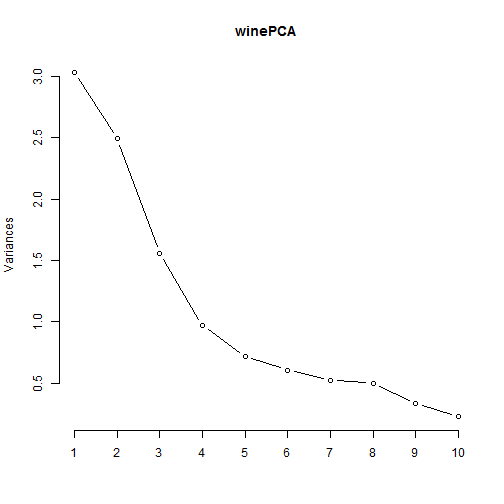 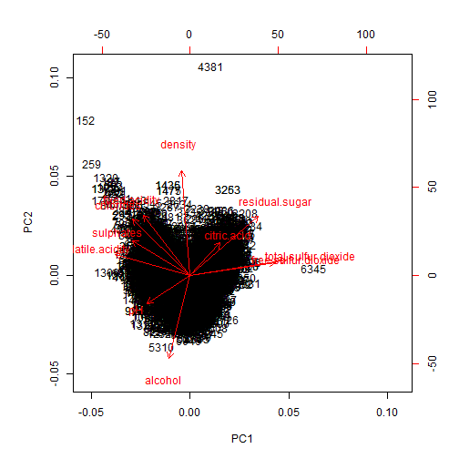 

```
##                              PC1         PC2         PC3         PC4
## fixed.acidity        -0.23879890  0.33635454 -0.43430130  0.16434621
## volatile.acidity     -0.38075750  0.11754972  0.30725942  0.21278489
## citric.acid           0.15238844  0.18329940 -0.59056967 -0.26430031
## residual.sugar        0.34591993  0.32991418  0.16468843  0.16744301
## chlorides            -0.29011259  0.31525799  0.01667910 -0.24474386
## free.sulfur.dioxide   0.43091401  0.07193260  0.13422395 -0.35727894
## total.sulfur.dioxide  0.48741806  0.08726628  0.10746230 -0.20842014
## density              -0.04493664  0.58403734  0.17560555  0.07272496
## pH                   -0.21868644 -0.15586900  0.45532412 -0.41455110
## sulphates            -0.29413517  0.19171577 -0.07004248 -0.64053571
## alcohol              -0.10643712 -0.46505769 -0.26110053 -0.10680270
##                             PC5         PC6         PC7          PC8
## fixed.acidity        -0.1474804 -0.20455371 -0.28307944  0.401235645
## volatile.acidity      0.1514560 -0.49214307 -0.38915976 -0.087435088
## citric.acid          -0.1553487  0.22763380 -0.38128504 -0.293412336
## residual.sugar       -0.3533619 -0.23347775  0.21797554 -0.524872935
## chlorides             0.6143911  0.16097639 -0.04606816 -0.471516850
## free.sulfur.dioxide   0.2235323 -0.34005140 -0.29936325  0.207807585
## total.sulfur.dioxide  0.1581336 -0.15127722 -0.13891032  0.128621319
## density              -0.3065613  0.01874307 -0.04675897  0.004831136
## pH                   -0.4533764  0.29657890 -0.41890702 -0.028643277
## sulphates            -0.1365769 -0.29692579  0.52534311  0.165818022
## alcohol              -0.1888920 -0.51837780 -0.10410343 -0.399233887
##                             PC9         PC10          PC11
## fixed.acidity         0.3440567 -0.281267685 -0.3346792663
## volatile.acidity     -0.4969327  0.152176731 -0.0847718098
## citric.acid          -0.4026887  0.234463340  0.0011089514
## residual.sugar        0.1080032 -0.001372773 -0.4497650778
## chlorides             0.2964437 -0.196630217 -0.0434375867
## free.sulfur.dioxide   0.3666563  0.480243340  0.0002125351
## total.sulfur.dioxide -0.3206955 -0.713663486  0.0626848131
## density               0.1128800 -0.003908289  0.7151620723
## pH                    0.1278367 -0.141310977 -0.2063605036
## sulphates            -0.2077642  0.045959499 -0.0772024671
## alcohol               0.2518903 -0.205053085  0.3357018784
```

* Split of red vs white wines across the two principal components 
* It is observed that the principal component analysis can be used to distinguish red and white wine

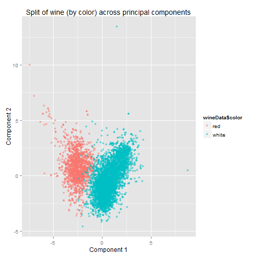 


* The major contributors/distingiushers within principal component 1 are :


```r
o1 = order(loadings[,1])
colnames(wineData2)[head(o1,3)]
```

```
## [1] "volatile.acidity" "sulphates"        "chlorides"
```

```r
colnames(wineData2)[tail(o1,3)]
```

```
## [1] "residual.sugar"       "free.sulfur.dioxide"  "total.sulfur.dioxide"
```

* We can validate this using boxplots.
* From the graph below we can validate that pc1 components actually differentiate between red and white wine (Looking back at the data, there is a clear distinction of the values for these metrics)

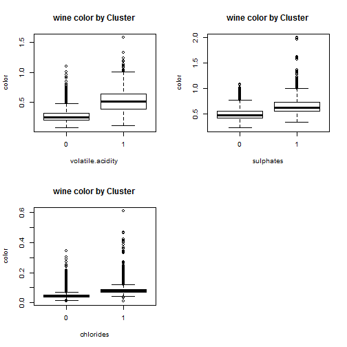 


* The MAJOR contributors of principal component 2 are

```r
o2 = order(loadings[,2])
colnames(wineData2)[head(o2,3)]
```

```
## [1] "alcohol"             "pH"                  "free.sulfur.dioxide"
```

```r
colnames(wineData2)[tail(o2,3)]
```

```
## [1] "residual.sugar" "fixed.acidity"  "density"
```

* From the graph below we can see that the main components making pc2 cannot differentiate between red and white wine.

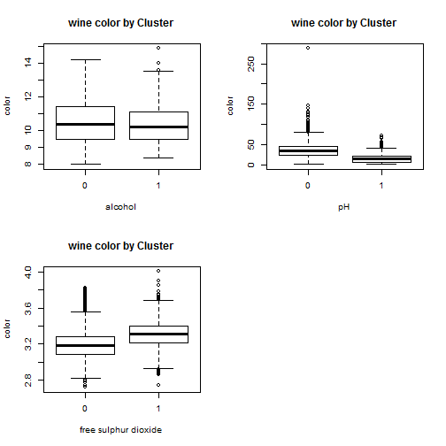 


###Verifying if pca can distinguish quality of the wine

* We cannot see any clear clustering of of the 9 different qualities of wine across any of the component projection (which can be understood as a 2D view of a n dimensional space)


```r
  comp <- data.frame(winePCA$x[,1:4])
  palette(alpha(brewer.pal(6,'Set3'), 0.15))
  plot(comp, col=wineData$quality, pch=19)
```

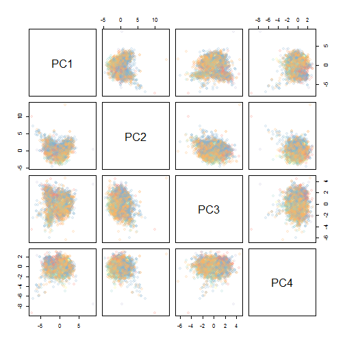 


## Hierarchical clustering

* Calculating the distance matrix using euclidean method and clustering the distance matrix with ward method.

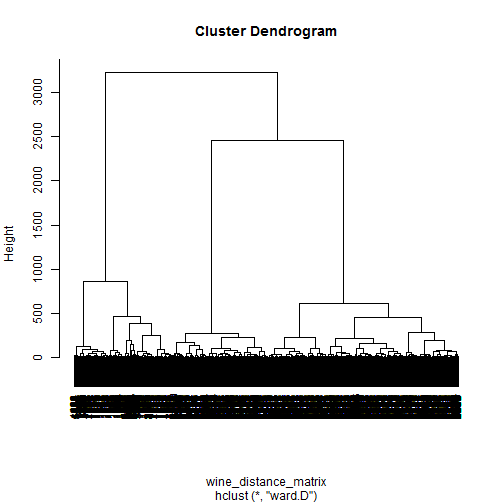 

* Using k=4 we select 4 clusters on the basis of the above plotted dendrogram

  
  ```r
  cluster1 = cutree(hier_wine, k=4)
  summary(factor(cluster1))
  ```
  
  ```
  ##    1    2    3    4 
  ##  580 1106 1598 3213
  ```

* The summary function gives us the number of objects in each cluster
* We can identify the number of red or white wines in each cluster using the table function


```r
  table(wineData[which(cluster1 == 1),13])
```

```
## 
##   red white 
##   572     8
```
The above cluster is predominantly         with an error of 

```r
  table(wineData[which(cluster1 == 2),13])
```

```
## 
##   red white 
##   982   124
```
The above cluster is predominantly         with an error of 

```r
  table(wineData[which(cluster1 == 3),13])
```

```
## 
##   red white 
##     8  1590
```
The above cluster is predominantly         with an error of 

```r
  table(wineData[which(cluster1 == 4),13])
```

```
## 
##   red white 
##    37  3176
```
The above cluster is predominantly         with an error of 


```r
  table(wineData$quality)
```

```
## 
##    3    4    5    6    7    8    9 
##   30  216 2138 2836 1079  193    5
```

* The table above provides a summary of the number of wines of each quality.
* It is seen that most data points lie in the values 5 to 7


###Verifying if clustering can distinguish quality of the wine

* Verifying the components of each cluster for quality

```r
table(wineData[which(cluster1 == 1),12])
```

```
## 
##   3   4   5   6   7   8 
##   6  37 264 235  35   3
```

```r
table(wineData[which(cluster1 == 2),12])
```

```
## 
##   3   4   5   6   7   8 
##   6  30 458 438 158  16
```


```r
table(wineData[which(cluster1 == 3),12])
```

```
## 
##   3   4   5   6   7   8   9 
##   3  29 709 712 123  21   1
```


* There is not much decipherable difference in the clusters with respect to quality, referring to a boxplot to confirm the same 


```r
table(wineData[which(cluster1 == 4),12])
```

```
## 
##    3    4    5    6    7    8    9 
##   15  120  707 1451  763  153    4
```

* It is seen that the quality also cannot be accurately inferred from the clustering method in use


```r
  boxplot(wineData$quality ~ cluster1,
        xlab='Cluster', ylab='quality',
        main='wine quality by Cluster')
```

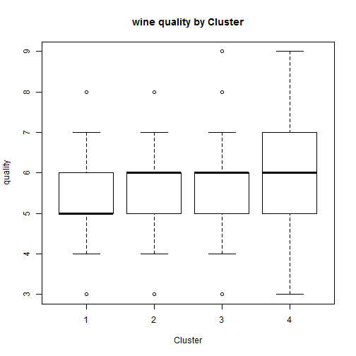 


* It can be inferred that although both PCA and clustering can differentiate red wine from white wine though none of the methods though gave any answer in regards to the quality of wine


#Solution 4

### Data Cleaning 

* Our major aim is to categorize the people into market segments based on interests and subject of tweets rather than number 
* So we have to normalize with the number of tweets (i.e. across rows)


```r
set.seed(3)

sData = read.csv('../data/social_marketing.csv')
sData2=sData[,-1]

sData3 = sData2/rowSums(sData2)

scaleData=scale(sData3, center=TRUE, scale=TRUE)
```


### Find optimum number of clusters

* Because this is ia unsupervised method and we have no idea about the expected number of clusters, we will do compute the CH index and find the optimum number of clusters which 

* Looking at the graph for CH vs K graph there seems to be 2/3 probable values of K. K=3,5 & 6 

* We can look at each of the splits and looking at the attributes which kind of segmentation makes more sense (actionable for the company)in a business context


```r
plot(2:kmax,ch, xlab='K', ylab='CH(K)', type='b',main='K-Means Clustering : CH Index vs K' )
```

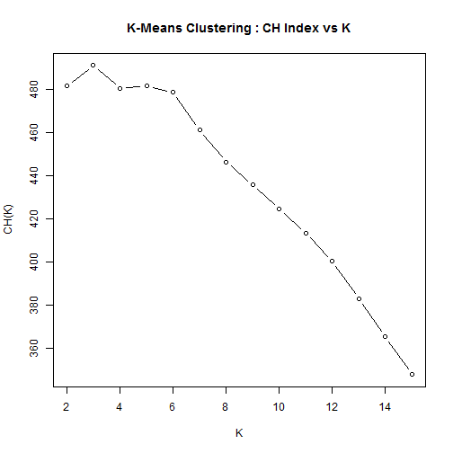 

### Number of segments = 3 

* We take top characteristics from the clusters and try 

* 3 Clusters doesnt seem a very good looking idea looking at the top cluster factors, they do not seem very intuitive in the sense of defininf a specific category of people

* Other take aways : 
  + Photosharing and Chatter are somethings which is common across clusters and can be understood as the basic activity within the twitter media for all kinds of people
  + So for inferring regarding market segments we can regarded as not valuable because that is not something which clearly defines a segment


```r
kmcf =kmeans(scaleData,3, nstart =50)

clust1= subset(sData2,kmcf$cluster==1)
head(sort(sapply(clust1,mean),decreasing = TRUE),n=8)
```

```
##        chatter  photo_sharing       politics    college_uni         travel 
##       5.037246       2.750564       2.341084       1.965237       1.895485 
##       shopping current_events  online_gaming 
##       1.585327       1.577427       1.467494
```

```r
clust2= subset(sData2,kmcf$cluster==2)
head(sort(sapply(clust2,mean),decreasing = TRUE),n=8)
```

```
## health_nutrition          cooking          chatter personal_fitness 
##         6.789403         4.940727         3.674899         3.626403 
##    photo_sharing          fashion         outdoors   current_events 
##         3.013471         2.034576         1.617423         1.448586
```

```r
clust3= subset(sData2,kmcf$cluster==3)
head(sort(sapply(clust3,mean),decreasing = TRUE),n=8)
```

```
## sports_fandom      religion          food       chatter     parenting 
##      4.577143      4.037551      3.550204      3.405714      3.079184 
##        school photo_sharing        family 
##      2.034286      1.926531      1.919184
```

### Number of segments = 6

* Cluster/Segment 1 
  
  + Looking at the major themes that is tweeted by this cluster of customers (Cooking,fashion, beauty, healthy nutrition shopping ), it seems that they are very likely to be health and fitness, fashion concious probably younger women 
  + This is a very good segment for the company to tap into for targeted marketing


```r
kmcf =kmeans(scaleData,6, nstart =50)

clust1= subset(sData2,kmcf$cluster==1)
head(sort(sapply(clust1,mean),decreasing = TRUE),n=8)
```

```
##          cooking    photo_sharing          fashion          chatter 
##         8.804162         4.572827         4.500612         3.570379 
##           beauty health_nutrition   current_events         shopping 
##         3.099143         1.620563         1.522644         1.357405
```


* Cluster/Segment 2

  + The major themes (religion, parenting , family, sports) point towards middle aged people with families children who might be a good target for special family offers / back to school offers 


```r
clust2= subset(sData2,kmcf$cluster==2)
head(sort(sapply(clust2,mean),decreasing = TRUE),n=8)
```

```
## sports_fandom      religion          food       chatter     parenting 
##      4.651596      4.125887      3.609929      3.367021      3.154255 
##        school        family photo_sharing 
##      2.061170      1.974291      1.920213
```

* Cluster/Segment 3

  + The major themes other than photosharing and chatter do not give any idiosncracy as such. Though movies and shopping are a bit prominent but not as high as other dominant themes in other clusters
  + Most probably these are people who donot have any specific tatstes / interests and generally use twitter intermittently and generically
  + This may not be a very good segment to tap into because they do not have any specific interests to cater to other than shopping 


```r
clust3= subset(sData2,kmcf$cluster==3)
head(sort(sapply(clust3,mean),decreasing = TRUE),n=8)
```

```
##        chatter  photo_sharing       shopping current_events        tv_film 
##      6.1012611      3.3872404      2.0756677      1.6654303      1.3004451 
##         travel       politics    college_uni 
##      1.1454006      0.9499258      0.9154303
```
  
  
* Cluster/Segment 4

  + Major themes (Health Nutrition, Personal Fitness, cooking , Outdoor , Food) point towards a very health concious group (may be middle aged men) which can be tapped into because the companys wants to promote its healthy products
  

```r
clust4= subset(sData2,kmcf$cluster==4)
head(sort(sapply(clust4,mean),decreasing = TRUE),n=8)
```

```
## health_nutrition personal_fitness          chatter          cooking 
##         9.649485         5.125920         3.602356         2.677467 
##         outdoors    photo_sharing             food   current_events 
##         2.153903         2.033873         1.730486         1.428571
```

* Cluster/Segment 5

  + Most frequent tweeted topics include politics, news, travel , automotive. This group seems to be middle aged well settled citizens who have strong opinions on the news, politics
  + They do not seem an obvious choice but can be converted if a special product is launched specifically targetting them
  


```r
clust5= subset(sData2,kmcf$cluster==5)
head(sort(sapply(clust5,mean),decreasing = TRUE),n=8)
```

```
##      politics          news        travel       chatter    automotive 
##      6.370528      4.126065      3.880750      3.491482      1.932709 
## sports_fandom photo_sharing     computers 
##      1.744463      1.693356      1.625213
```

* Cluster/Segment 6

  + Based on themes(College univ, online gaming ,sport playing) it can be inferred these are college students and can be targetted with special offers for students 


```r
clust6= subset(sData2,kmcf$cluster==6)
head(sort(sapply(clust6,mean),decreasing = TRUE),n=8)
```

```
##    college_uni  online_gaming        chatter  photo_sharing sports_playing 
##       7.968970       6.987306       3.548660       2.076164       1.954866 
##        tv_film current_events         travel 
##       1.530324       1.355430       1.332863
```

